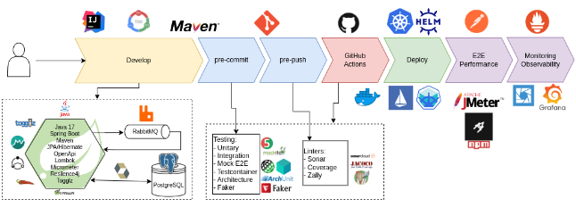

# Your Race

Rafael Gómez Olmedo, Raquel Toscano Marchena.
https://github.com/MasterCloudApps-Projects/your-race

### Overview
Your Race is a DevOps PoC (Proof of concept) for building an scalable platform for managing entry assignment in highly demanded races, like the New York City Marathon or _101 Km de Ronda_ (Spain).

In this repository you will find:
- The codebase.
- Database scripts for generate testing data.
- Scripts to run performance tests in [Artillery](artillery.io).

### Workflow




## Setup

### System requirements
Java 17, Maven, npm, Artillery, Docker, Docker compose, kubectl, Minikube, Helm, PostgreSQL cli.

Check out information in [Local Dev Setup](./docs/local-dev-setup.md) for local development setup.

### K8s Setup + prometheus helm

```sh
minikube start \
--cpus 4 --memory 16g \

helm repo add prometheus-community https://prometheus-community.github.io/helm-charts
helm repo add stable https://charts.helm.sh/stable
helm repo update
helm install prometheus prometheus-community/prometheus
```
Reference: [1] 

### Install your-race services
```sh
kubectl apply -f k8s/manifests-operator/
```

### Install Istio:

```sh
minikube addons enable metrics-server
minikube addons enable istio-provisioner
minikube addons enable istio


cd k8s
curl -L https://istio.io/downloadIstio | sh -
cd istio-1.15.3
export PATH=$PWD/bin:$PATH
istioctl install --set profile=demo -y
kubectl label namespace default istio-injection=enabled
```

#### Istio gateway deployment

```sh
kubectl apply -f k8s/istio/
```

#### Find out Istio gateway

```sh
export INGRESS_PORT=$(kubectl -n istio-system get service istio-ingressgateway -o jsonpath='{.spec.ports[?(@.name=="http2")].nodePort}')
export INGRESS_HOST=$(minikube ip)
echo "http://$INGRESS_HOST:$INGRESS_PORT"
```

### Artillery

```sh
cd performance
artillery run artillery{XXX}Test.yml
```

### JMeter

jmeter > [Test Plan.jmx](/performance/Test%20Plan.jmx)

### Grafana

Import Dashboard:
- 9628 for Postgres
- 4701 Micrometer JVM
- 6417 K8s Cluster
- import [Personalized Dashboard](/grafana/personalized.json)


### Feature Toggle 

Console:
```
http://localhost/togglz-console/index
``` 
Feature toggle list:
- "Use RabbitMQ producer".


### Postman Collection
[Postman Collection](/your-race/your-race.postman_collection.json).


## How to run a performance test with Artillery

Checkout step-by-step walkthrough in [How to run a test](./docs/how-to-run-a-test.md).

In [How to generate data for Testing](./docs/how-to-generate-data-for-testing.md) you can find out how to generate test data.


## References

- [1] https://refactorizando.com/autoescalado-prometheus-spring-boot-kubernetes/
- https://jschmitz.dev/posts/testcontainers_how_to_use_them_in_your_spring_boot_integration_tests/
- [Error types](./docs/error-types.md)
___
## :es: Documentación de Entrega TFM Máster CloudApps

### Memoria

https://docs.google.com/document/d/17cHzdHlvV2ujh2DzF1rlHlmz_qfKArxPLsnF-EycibQ/edit?usp=sharing

### Presentación
https://docs.google.com/presentation/d/1F3jRpaACY1rKTt9T7lfJ5u6ywyYn1eU1fU61MXd-buE/edit?usp=sharing 


